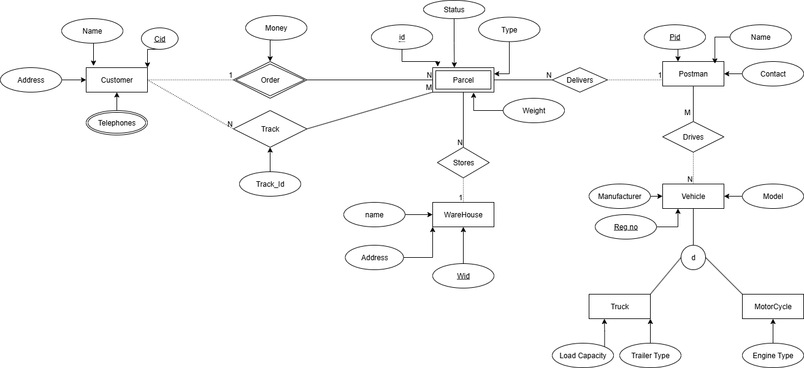

# Parcel Delivery Database System

## Overview

This project involved the design and implementation of a relational database for a parcel delivery management system. The system supports the storage and management of information relating to customers, parcels, warehouses, delivery staff, vehicles, and parcel deliveries.

The project demonstrates the complete database design lifecycle, from requirements analysis and conceptual modelling through to relational schema design and SQL implementation.

---

## Project Objectives

- Design a relational database for a parcel delivery management system.
- Develop an Entity-Relationship (ER) model based on business requirements.
- Convert the ER model into a BCNF-normalised relational schema.
- Implement the database using SQL.
- Develop SQL queries to support common business operations.

---

## Technologies Used

### Database

- SQL

### Database Design

- Entity-Relationship (ER) Modelling
- Relational Database Design
- BCNF Normalisation
- Primary & Foreign Keys
- Integrity Constraints

---

## Methodology

1. Analyse system requirements.
2. Identify entities, relationships and attributes.
3. Design an Entity-Relationship (ER) diagram.
4. Convert the ER model into a BCNF-normalised relational schema.
5. Implement database tables using SQL.
6. Develop SQL queries to retrieve and manipulate data.
7. Validate database integrity and relationships.

---

## Entity-Relationship Diagram

The database was first designed using an Entity-Relationship (ER) model to capture the relationships between customers, parcels, warehouses, vehicles, delivery staff, and deliveries. The conceptual model was then transformed into a BCNF-normalised relational database before being implemented in SQL.

---

## Database Features

The implemented database includes entities representing:

- Customers
- Parcels
- Warehouses
- Postmen
- Vehicles
- Deliveries

Relationships were implemented using primary keys, foreign keys and referential integrity constraints.

---

## Example SQL Operations

The database implementation demonstrates a range of SQL operations, including:

- Table creation using `CREATE TABLE`
- Data insertion using `INSERT`
- Data modification using `UPDATE`
- Record deletion using `DELETE`
- Multi-table joins
- Aggregate queries using `GROUP BY`
- Nested subqueries
- Division queries
- Referential integrity using primary and foreign keys
- Cascading deletes

---

## Repository Structure

- `sql/` – SQL implementation of the database.
- `documentation/` – Project report describing the database design and implementation.
- `images/` – Entity-Relationship diagram.

---

## Skills Demonstrated

- SQL Programming
- Database Design
- Entity-Relationship Modelling
- Relational Database Design
- BCNF Normalisation
- Query Optimisation
- Data Integrity
- Problem Solving
- Technical Documentation

---

## Author

**Akhileshwar Reddy Kolanupaka**

Master of Data Science

The University of Queensland
